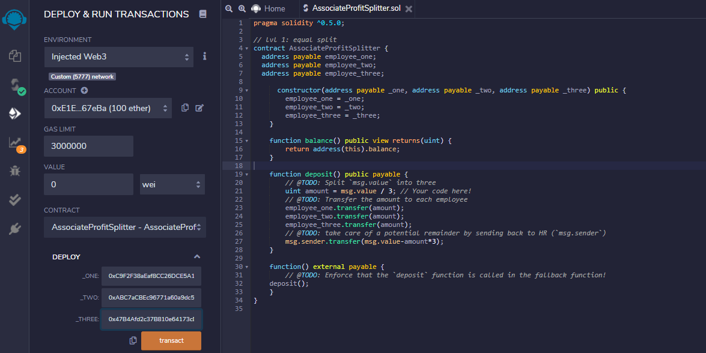
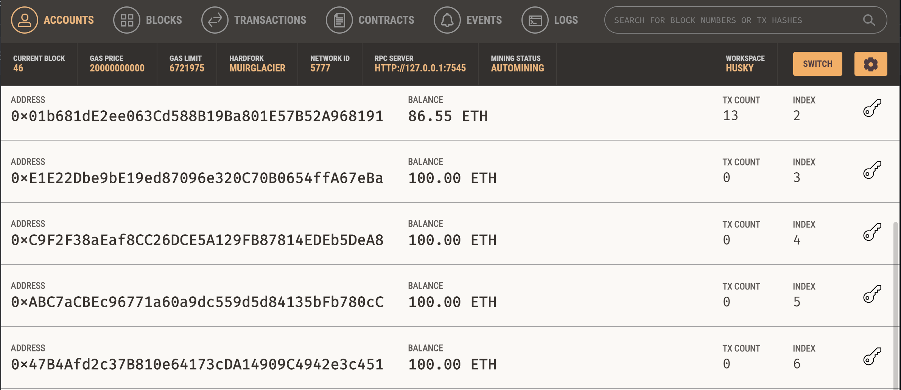
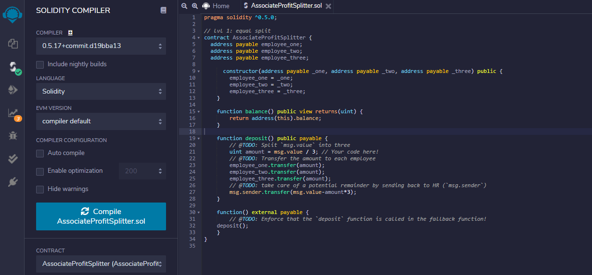
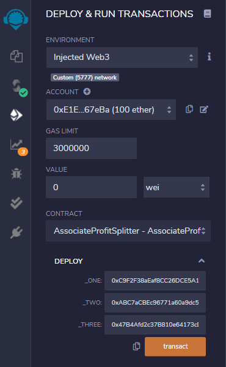
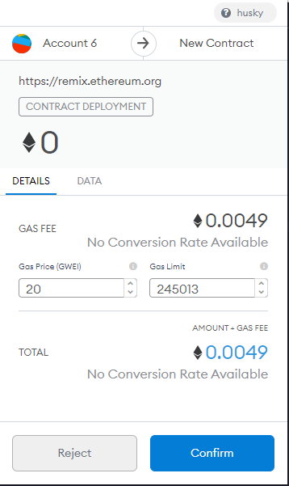
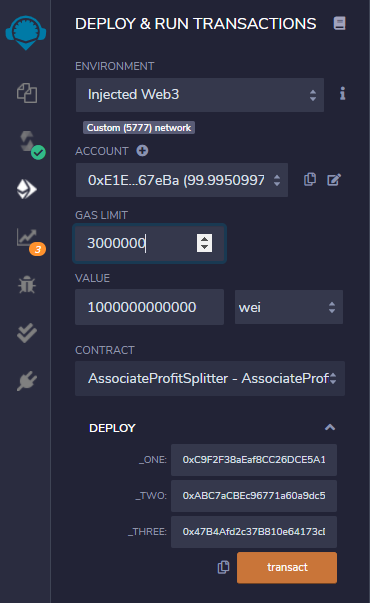
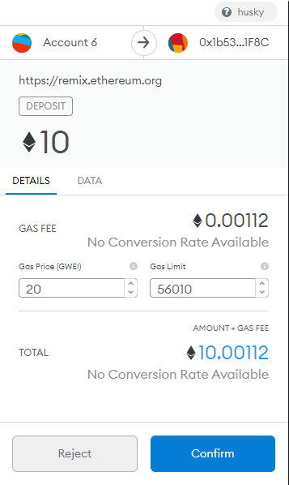
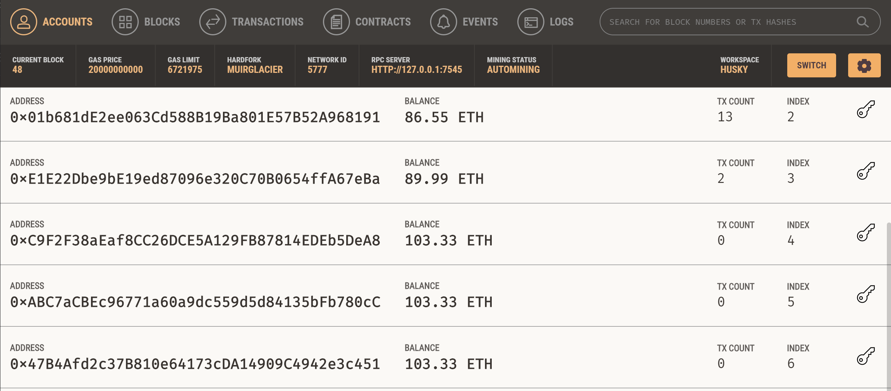

# Homework 20 - Solidity

John-Francis Kraemer

Contract Address: 0x1b53F1f98c4D6df42A4572ACB5EF02D98A431F8C

Withdrawing Address: 0xE1E22Dbe9bE19ed87096e320C70B0654ffA67eBa

Employee 1 Address: 0xC9F2F38aEaf8CC26DCE5A129FB87814EDEb5DeA8

Employee 2 Address: 0xABC7aCBEc96771a60a9dc559d5d84135bFb780cC

Employee 3 Address: 0x47B4Afd2c37B810e64173cDA14909C4942e3c451

## Contract 1
The solidity smart contract for AssociateProfitSplitter.sol will allow the deposit of 10 ETH to each of the 3 employeees and will sweep any remaining amounts back to the withdrawing account.

The smart contract amount in addresses that represent employee_one, employee_two, and employee_three for AssociateProfitSplitter.sol before the smart contract is activated.  The address ending in ...67eBa serves as the withdrawing account with the subsequent 3 address presenting the depositing accounts of the 3 employees.  All 4 addresses have a starting balance of 100 ETH

The smart contract AssociateProfitSplitter.sol is compiled.

The smart contract AssociateProfitSplitter.sol activated by hitting the "Transact" button and is also connected to the Custom 5777 network (MetaMask account).

The activated smart contract is reflected within MetaMask.

The smart contract makes a deposit of 10 ETH that is reflected within MetaMask and Ganache.

The ending balances of the withdrawing account ending in ...67eBa is deducted 10 ETH (plus gas fees) with an ending balance of 89.99 ETH and the subsequent addresses of the 3 employees received 3.33 ETH with an ending balance of 103.33 ETH.
